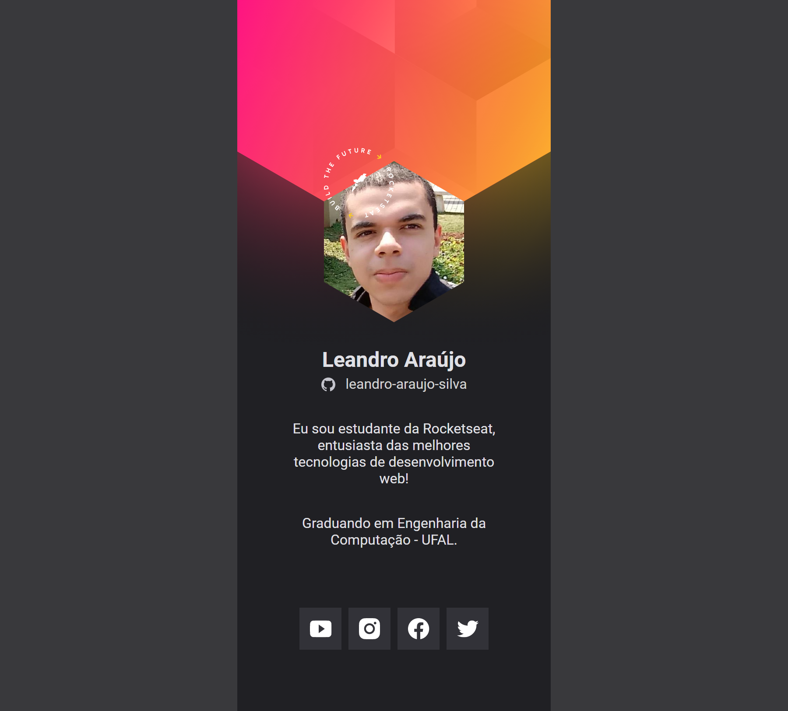

<h1 style="text-align: center; font-weight: bold;">Crachá para o DoWhile 2021</h1>

## Demonstração 📸

  

---

## Sobre o Projeto

Projeto realizado no NLW Heat.

### 🛠 Tecnologias

As seguintes ferramentas foram usadas na construção do projeto:

- [HTML5]
- [CSS3]
- [JavaScript]

---

 

Veja meu Linkedin: [LEANDRO ARAÚJO] 